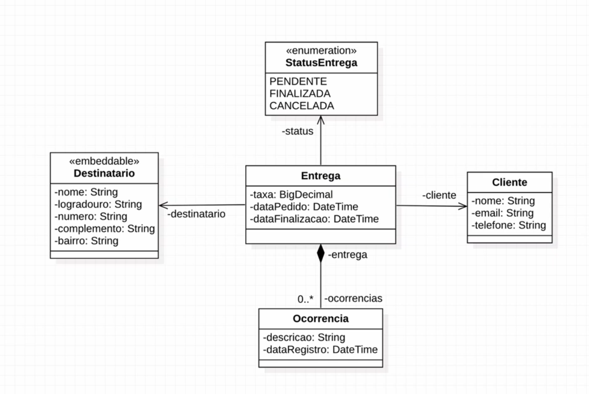

# API Logistic Company

PROJECT CREATED BASED ON A https://www.algaworks.com/ PROJECT

Tools used for this project:

*   Built in Spring boot;
*   MySQL as relational database;
*   Lombok to generate getters, setters, hashCode constructors and so on;
*   Bean for work with data validation;
*   FlyWay to manage table creations(migrations);

I also decided to implement the cancellation method that was not created during the workshop. And I consumed a Brazilian ZIP code API that fills out the address based on the code.

The UML diagram for the project:

We have a customer class that is related to a delivery. Each delivery has a recipient, a enum class that shows the delivery status as: pending, cancelled and delivered. We can also create an event for a delivery with a message. e.g.: 'Recipient was not home'. 

There is a file called "Semana SpringBoot.postman_collection.json" in this repository that can be used to test the application using PostMan.